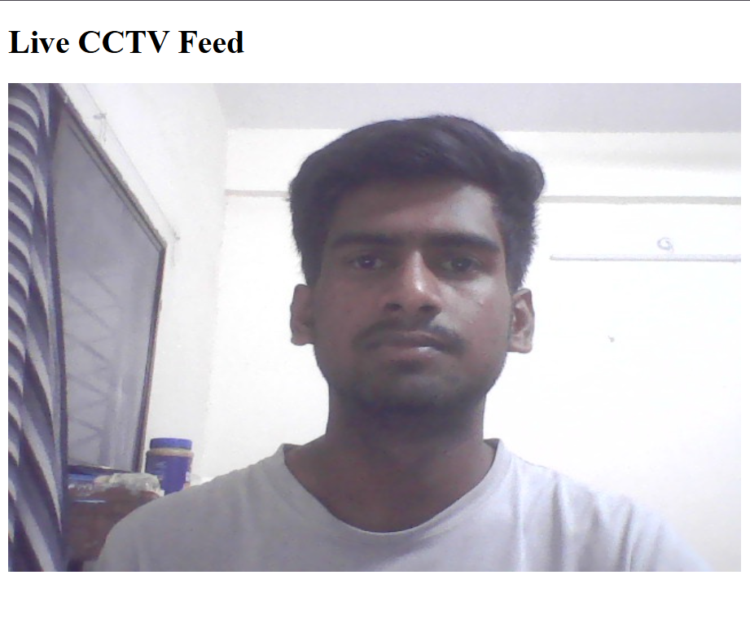

# 📹 CCTV Live Stream with Flask

A lightweight web app to stream **live video from your webcam or IP camera** directly in your browser — built using **Python**, **OpenCV**, and **Flask**.

<p align="center">
  
  
  
  
</p>

---

<details>
<summary><strong>🚀 Features (click to expand)</strong></summary>

- 🔴 **Live streaming** from webcam or IP camera
- 💻 Simple browser-based interface
- 🧩 Modular code — easy to extend or modify
- 🛠️ Lightweight and minimal dependencies

</details>

---

## 🧰 Requirements

- [Python 3.x](https://www.python.org/downloads/)
- [Flask](https://pypi.org/project/Flask/)
- [OpenCV (`cv2`)](https://pypi.org/project/opencv-python/)

<details>
<summary><strong>📦 Install all dependencies</strong></summary>

```bash
pip install flask opencv-python
```
</details>

---

## 📁 Project Structure

<details>
<summary>Click to view</summary>

```
cctv-live-stream/
├── app.py               # Main Flask app
├── camera.py            # Handles video capture (OpenCV)
├── templates/
│   └── index.html       # Frontend template
└── README.md            # You're here!
```
</details>

---

## ⚙️ Configuration

<details>
<summary><strong>How to use your own camera</strong></summary>

By default, the app uses your default webcam (`cv2.VideoCapture(0)`).

To use an IP camera, edit `camera.py`:

```python
# Change this:
cv2.VideoCapture(0)

# To something like:
cv2.VideoCapture("http://<IP_ADDRESS>:<PORT>/video")
```
</details>

---

## 💡 How to Run

<details open>
<summary><strong>Step-by-step guide</strong></summary>

1. **Clone or download the project:**
    ```bash
    git clone https://github.com/your-username/cctv-live-stream.git
    cd cctv-live-stream
    ```

2. **Run the app:**
    ```bash
    python app.py
    ```

3. **Open your browser and go to:**
    ```
    http://localhost:5000/
    ```
    You should now see your live video feed! 🎉
</details>

---

## 🖼️ Screenshot



---

## 🚀 Try it now!

> **Tip:** Want to deploy online?  
> [](https://replit.com/github/your-username/cctv-live-stream)  
> [](https://heroku.com/deploy?template=https://github.com/your-username/cctv-live-stream)

---

## 📜 License

This project is licensed under the MIT License  
Use it freely for learning, demos, or extending your own projects!

---

## 🙋‍♂️ Contributing

Found an issue or have a feature idea?  
Feel free to open an issue or a pull request.

---

<blockquote>
  <strong>💬 "Streaming made simple with Flask and OpenCV!"</strong>
</blockquote>

---

<sub>Let me know if you'd like a logo, deploy button, or setup guide for IP cameras too!</sub>
